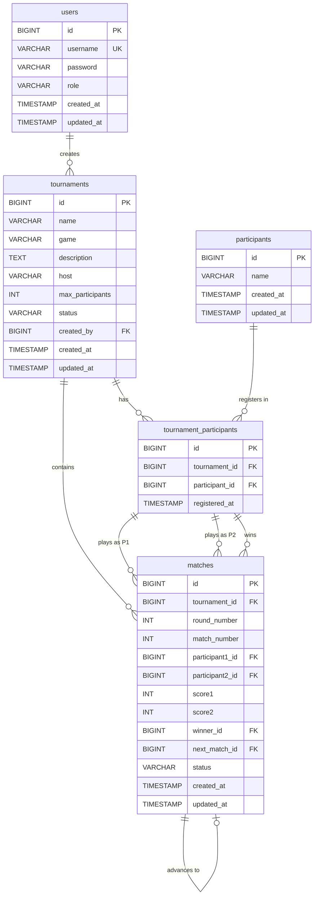

# Esport Tournament System - ERD Diagram

## Mermaid ER Diagram

## Relationship Summary

| Relationship | Type | Description |
|-------------|------|-------------|
| users → tournaments | 1:N | A user can create multiple tournaments |
| tournaments → tournament_participants | 1:N | A tournament has multiple registered participants |
| participants → tournament_participants | 1:N | A participant can register in multiple tournaments |
| tournaments → matches | 1:N | A tournament has multiple matches |
| tournament_participants → matches (as P1) | 1:N | A participant can play as player 1 in multiple matches |
| tournament_participants → matches (as P2) | 1:N | A participant can play as player 2 in multiple matches |
| tournament_participants → matches (winner) | 1:N | A participant can win multiple matches |
| matches → matches (next_match) | 1:0..1 | A match can advance to at most one next match |
